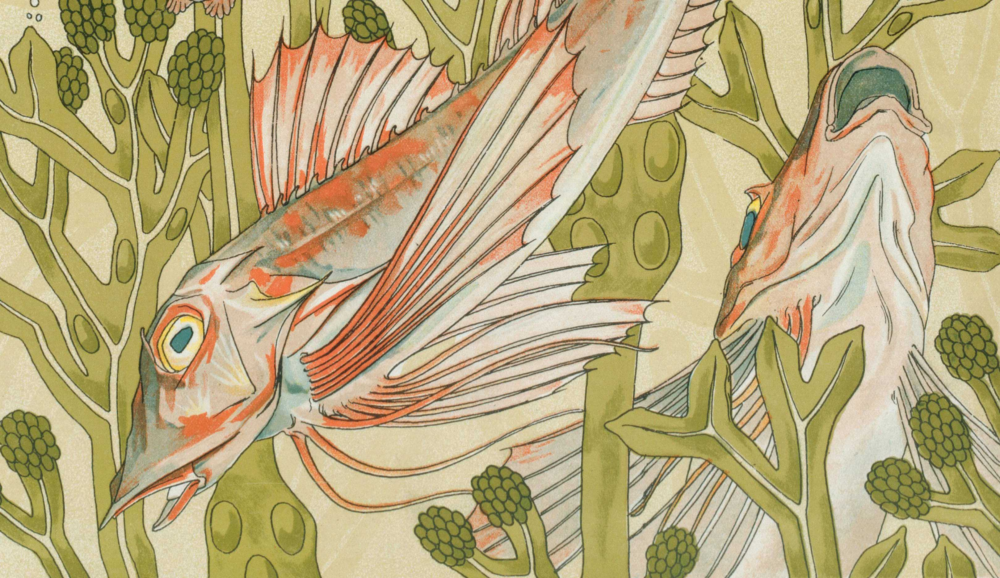
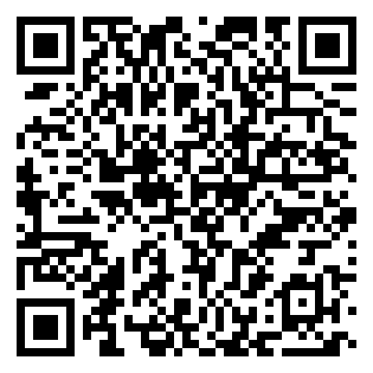

# Chika, a free server designed for [Delta Chat](https://delta.chat) users

_Chika means gossip in Tagalog._ 

Welcome to [instant, interoperable, and privacy-centric chat](https://delta.chat/chatmail) run by [Aangat Lahat](https://aangat.lahat.computer) / [Durian Distro](https://durian-distro.org/). 

[Delta Chat](https://delta.chat) is a secure decentralized messenger that allows people to chat with each other even if they're on different servers. This is just one of [many](https://delta.chat/chatmail), and it has the following features:

- No phone numbers, email addresses, real names, etc. are needed for an account.
- {{ config.max_mailbox_size }} of storage space for users.
- Server keeps messages for at most {{ config.delete_mails_after }} days. 
    - (Don't worry this only affects you if you're offline for this long.)
- People aren't allowed to send unencrypted messages.
- It does not store IP addresses.
- Inactive accounts are deleted after 2 years.

Feel free to use [Orbot](https://orbot.app/) or a trusted VPN when you're using this service as well for increased privacy.

## Creating an account

1\. <b>Download</b> [Delta Chat](https://delta.chat) on your phone or computer.

2\. <b>Tap</b> or scan this QR code to get a random `@{{config.mail_domain}}` address

<a class="cta-button" href="DCACCOUNT:https://{{ config.mail_domain }}/new"><button>Get a {{config.mail_domain}} chat profile</button></a>

If you are viewing this page on a different device
without a Delta Chat app,
you can also <b>scan this QR code</b> with Delta Chat:

<a href="DCACCOUNT:https://{{ config.mail_domain }}/new">
    
    <!--  -->
</a>

3\. <b>Choose</b> your avatar and name

4\. <b>Start</b> chatting with any Delta Chat contacts using [QR invite codes](https://delta.chat/en/help#howtoe2ee) or invite links like this one [durian.distro@systemli.org](https://i.delta.chat/#A0E7290EB162D14C5E32358E38559370D0875CF0&a=durian.distro%40systemli.org&n=&i=g6jPAj4yzsm&s=8G3sbHejPQR).

## Nazis fuck off

This service is built around the concept of care and mutual aid. Since data extraction and surveillance is everywhere in our digital world, I wanted to share a server that gives free, private, and secure communications to people. We need to take care and help each other, now more than ever. 

So if you're using this service to practice the opposite like promoting fascism, nazism, militarism, copaganda, zionism, state nationalism, antisemitism, or contributing to the discrimination, harassment or harm against any individual or group through forms of discrimination based on gender, race, religion or sexual orientation, along with issuing statements which are racist, xenophobic, ableist or discriminatory in any other form, you will be blocked. Also, don't use this service to promote your businesses.

If you have the following or similar kinds of ideologies or affiliations, you are not welcome here:

- Neo-fascism (white supremacy / white nationalism / neo-nazi / alt-right / alt-light / identitarian / male supremacy / manosphere)
- Reactionary (GamerGate / anti-feminism / neo-reactionary)
- Neo-feudalism ('anarcho'-capitalism / 'objectivism' / right-wing libertarians)
- TERF, SWERF or otherwise anti-trans or anti-sex worker
- Truscum, transmed or other kinds of identity policing.
- People who are generally phobic/shitty towards non-binary genders.
- Religious fundamentalism or anti-abortion.
- Militarism, chauvinism, ethno-nationalism, xenophobia or similar.
- Pro-bestiality/zoophilia
- People who share sexualized images of children (lolicon or similar)
- Tech bros (capitalists promoting AI / cryptocurrency / tech businesses)

If you work in any capacity (whether as a direct employee or a contractor) for any of the following types of organisations, you aren't welcome here, and if you reveal yourself as such, you will be blocked:

- Military
- Police
- Immigration enforcement

However, ideologies or affiliations based on counter-violence in opposition to oppression (like antifa/antifascism) are welcome here.

Report accounts to me at [durian.distro@systemli.org](https://i.delta.chat/#A0E7290EB162D14C5E32358E38559370D0875CF0&a=durian.distro%40systemli.org&n=&i=g6jPAj4yzsm&s=8G3sbHejPQR). Thank you to [weirder.earth](https://github.com/weirderearth/weirder-rules/blob/main/rules-and-etiquette.md) and [Autistici](https://www.autistici.org/who/policy) for the inspiration.

## Donations

- I would appreciate donations to cover labor and server costs! I run services like this one, [Tor relays](https://metrics.torproject.org/rs.html#search/family:5589C16812A8E9C5BF1EB25EEC8060B877E24F56), and a [zine and mask distro](https://durian-distro.org). I accept [Ko-fi](https://ko-fi.com/duriandistro), [Liberapay](https://liberapay.com/durian-distro/), or [Monero](https://durian-distro.org/#Monero).
- Donate to [Delta Chat](https://delta.chat/en/contribute) as well if you can!

## News

#### February 12, 2025
<i>Bush warblers start singing in the mountains</i>

Moved the server to a VPS in [UDN](https://www.urdn.com.ua). They have more flexible plans that lets me increase CPU, RAM, and disk space a little bit at a time. I also wanted to operate the server outside of my own jurisdiction to give some protection to people using this service.